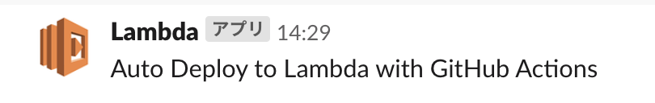
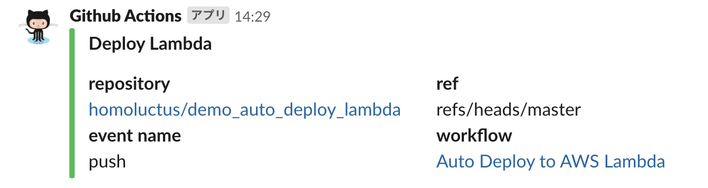
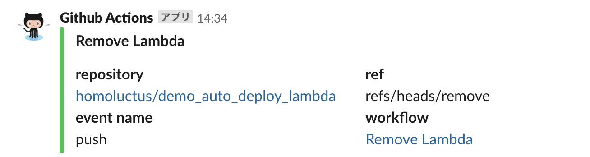
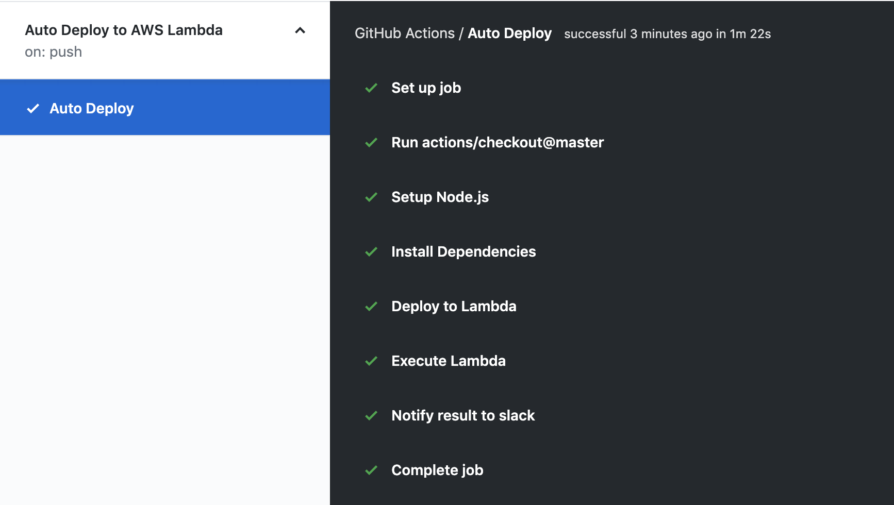
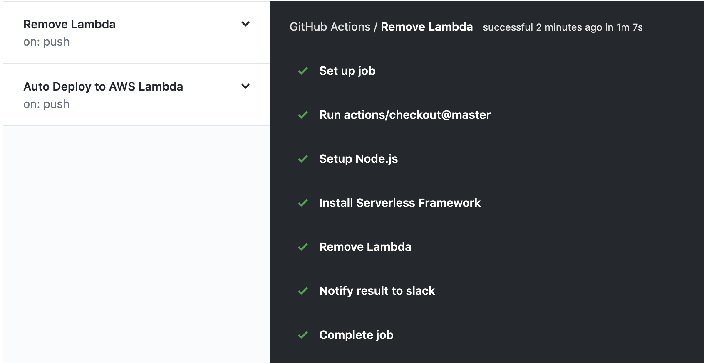

# Demo Auto Deploy Lambda
This repository is demo app to automatically deploy to AWS Lambda using GitHub Actions

# Usage
## 1. Set GitHub secrets
Set the following parameters in GitHub secrets:

- AWS_ACCESS_KEY_ID
- AWS_SECRET_ACCESS_KEY
- SLACK_WEBHOOK

## 2. Uncomment YAML file
Please uncomment `.github/workflows/deploy.yml` and `.github/workflows/remove.yml`. 

## 3. Push to master branch
Start deploy to AWS Lambda when you push to master branch. 
So, you commit and push after uncommenting the above two files.

## 4. Deploy using GitHub Actions
Start GitHub Actions and automatically deploy to AWS Lambda after pushed to master branch. 
So, You just wait. 
After tens seconds or minutes, you receive a slack notification like below. 

- Invoke Lambda function

- GitHub Actions Success

## 5. Remove Lambda
You push to branch called 'remove'. 
GitHub Actions deletes Lambda instead of you.
After a moment, you receive a notification like below. 

# GitHub Actions screen
## Deploy Lambda

## Remove Lambda

